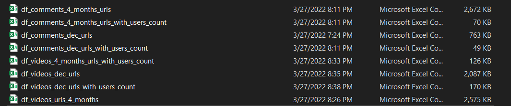
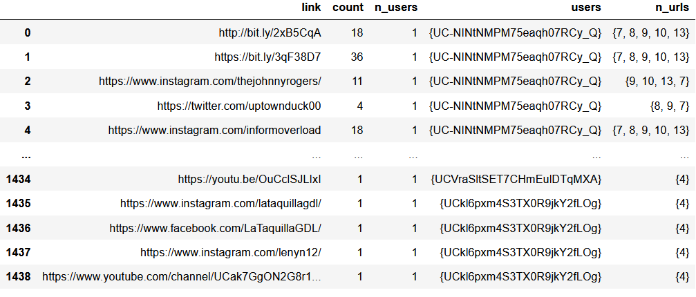

# Data Description
**Parsing URLs from Platforms Data.**

## Contents

- Youtube.

    - df_{comments-videos}_{4_months-dec}_urls: the original dataframes with all rows that contain urls on the text. 
    - df_{comments-videos}_{4_months-dec}_urls_with_users_count: a new datadrame contains 5 columns:
        - link: shared url.
        - count: how many times this url shared on that data.
        - n_users: number of users shared that link.
        - users: set of users sharedd that link.
        - n_urls: set of number of urls mentioned alongside that link; {1} means this link is shared alone, {6,5}: this link share beside 5 or 4 links. 
    
